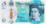
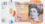

# Pokémon Cards Holographic effect in CSS

This is a repository holder for the Pokemon Cards CSS Holographic effect.  

🔥 As seen on [css-tricks.com](https://css-tricks.com/holographic-trading-card-effect/) and [codepen](https://codepen.io/simeydotme/pen/abYWJdX)  
🌟 Demo running @ https://poke-holo.simey.me/

Vue implementation of Pokémon Cards Holographic effect in CSS .

from (https://github.com/simeydotme/pokemon-cards-css).

Thanks to the vue implementation of (https://github.com/Maurier/vue-pokemon-cards-css)

### A collection of advanced CSS styles, applied with vue.js.


---


## install

```
npm i vue-pokemon-cards-css
```


## Example


```vue
<!--
 * @Author: 时不待我 790002517@qq.com
 * @Date: 2022-12-17 22:18:59
 * @LastEditors: 时不待我 790002517@qq.com
 * @LastEditTime: 2022-12-18 13:16:53
-->

<template>
  <div class="showcase" @click="active = null">
    <div>
      <div class="slice">
        <vue-pokemon-cards-css
          v-for="card of slices"
          @click.native.stop="active = active === card ? null : card"
          :key="card.id"
          :name="card.name"
          :img="card.images.large"
          :number="card.number"
          backimg="https://tcg.pokemon.com/assets/img/global/tcg-card-back-2x.jpg"
          :supertype="card.supertype"
          :subtypes="card.subtypes"
          :rarity="card.rarity"
          :gallery="card.gallery"
          :active="active === card"
        />
      </div>
    </div>
  </div>
</template>
<script lang="ts">
import Vue from "vue";
//导入
import VuePokemonCardsCss from "vue-pokemon-cards-css";

//导入渲染的数组
let cards = require("@/assets/data.json");
//数组进行处理
cards = cards.map((card) => {
  return {
    ...card,
    rarity: card.rarity.toLowerCase(),
    supertype: card.supertype.toLowerCase(),
    subtypes: Array.isArray(card.subtypes)
      ? card.subtypes.join(" ").toLowerCase()
      : card.subtypes.toLowerCase(),
    gallery: card.number.startsWith("TG"),
  };
});
export default Vue.extend({
  name: "ServeDev",
  components: {
    VuePokemonCardsCss,
  },
  data() {
    return {
      active: null,
      slices:
        cards.slice(0, 6),
    };
  },
});
</script>

<style lang="scss" scoped>
.showcase {
  padding: 4rem;
}

.slice {
  margin-bottom: 4rem;
  display: grid;
  grid-template-columns: repeat(auto-fill, minmax(300px, 1fr));
  gap: 4rem;
}

hr {
  opacity: 0.35;
  border-bottom: 1px solid #000;
  margin-bottom: 3rem;
}
</style>
```

### data.json

```
https://github.com/zzy-life/components-pokemon-cards-css/blob/master/src/assets/data.json
```


## options

### subtypes && rarity

Card material (supertype and subtype)


| data.json                                         |
| ------------------------------------------------- |
| // basics                                         |
| cards.slice(0, 6),                                |
| // holos                                          |
| cards.slice(6, 12),                               |
| // galaxies                                       |
| cards.slice(12, 15),                              |
| // radiant                                        |
| cards.slice(15, 18),                              |
| // basicGallery                                   |
| cards.slice(60, 63),                              |
| // vee                                            |
| cards.slice(18, 21),                              |
| // veeUltra                                       |
| cards.slice(21, 24),                              |
| // veeAlt                                         |
| [...cards.slice(27, 30), ...cards.slice(33, 36)], |
| // veeMax                                         |
| cards.slice(24, 27),                              |
| // veeMaxAlt                                      |
| [cards[36], cards[31], cards[37]],                |
| // veeStar                                        |
| cards.slice(39, 42),                              |
| // trainerHolo                                    |
| cards.slice(42, 48),                              |
| // rainbow                                        |
| cards.slice(48, 51),                              |
| // gold                                           |
| cards.slice(51, 60),                              |
| // veeGallery                                     |
| cards.slice(63, 69),                              |

### images.small

small picture

### images.large

big picture

### backimg

card back view


## Local operation

### Project setup

```
npm install
```

### Compiles and hot-reloads for development

```
npm run serve
```

### Compiles and minifies for production

```
npm run build
```


#### support / tip

If you think this is super cool, or useful, and want to donate a little, then you are also super cool!

|                                                              |                                                              |                                                     |
| ------------------------------------------------------------ | -----------------------------------------------------------: | --------------------------------------------------- |
|  | [](https://www.paypal.com/paypalme/simey/1) | [£1 tip](https://www.paypal.com/paypalme/simey/1)   |
|  | [](https://www.paypal.com/paypalme/simey/5) | [£5 tip](https://www.paypal.com/paypalme/simey/5)   |
|  | [](https://www.paypal.com/paypalme/simey/10) | [£10 tip](https://www.paypal.com/paypalme/simey/10) |


---

#### attribution

<sub>- Galaxy Holo from [aschefield101](https://www.deviantart.com/aschefield101/art/HoloSheet-2012-313543843)</sub>  
<sub>- Some backgrounds from [Vecteezy](https://www.vecteezy.com/free-photos)</sub>
